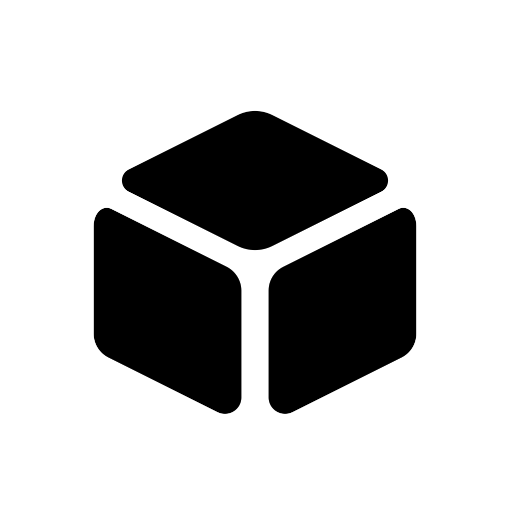

<p align="center">
  
</p>

<h1 align="center">回见</h1>

“回见”是一款面向 iPhone / iPad 的空间记录应用。当前版本先完成定点 360° 全景记录与浏览；长期目标是 **6DoF 空间记录**，让用户在有限的已采集范围内移动、旋转和缩放查看，并把文字、图片或语音信息绑定到空间中的物品。

> 项目目前处于 MVP 初始化阶段。现阶段优先验证“采集、浏览、标注、保存”的产品闭环，高质量摄影测量与 3D Gaussian Splatting（3DGS）将作为后续能力接入。

## 产品路线

核心技术路线为：

```text
iPhone / iPad
  ARKit 采集图像、相机位姿、深度与空间网格
        ↓
  本地低精度预览、场景管理与空间标注
        ↓
  服务端摄影测量（规划：COLMAP / AliceVision）
        ↓
  带纹理网格（USDZ / GLB）+ 可选 3DGS 视觉层（SPZ）
        ↓
  RealityKit / Metal 浏览、测量与标注
```

网格将作为碰撞、测量和标注的稳定几何基础；3DGS 只负责高真实感外观，避免把不稳定的视觉点云当作权威空间几何。

## 当前 MVP 能力

- SwiftUI 应用框架与原生 Xcode 工程
- 记录方式选择：定点全景、多点全景，以及暂未开放的自由空间占位
- 定点全景：将画面中的动态目标点依次移入中央对准环；在一个位置按 5 层俯仰带采集 38 个球面方向，其中顶部和底部各采集 1 张，生成一张标准 2:1 等距柱状全景图
- 多点全景：记录 3 个间距至少 1 米的固定点，每个点都使用相同的中央目标引导并独立生成完整 360° 全景图
- ARKit / RealityKit 采集界面与自动完成状态机；进入取景页后只做定位准备，用户再次点击“开始拍摄”才建立点位和采集画面
- 当前全景流程只检测 LiDAR 能力，不启动不参与成片的网格重建、深度语义、环境纹理或调试可视化
- 当前点位坐标、跟踪状态、球面覆盖图、遗漏方向和移动距离引导
- 普通方向需满足连续位姿稳定与 30 cm 光心漂移约束；顶部和底部单张允许更自然的手臂移动。稳定后只请求一张 ARKit 高分辨率帧，减少连续采集时的停顿
- 顶部和底部目标位于 ±65°，并使用不依赖水平朝向的极区确认，减少天顶和地面黑边。覆盖完整后自动结束；Metal 在线性色彩空间执行清晰度与抗视差优先的两阶段选帧融合，并对偏离稳健光心的帧降权，生成 6144 × 3072 HEIC 全景图和场景元数据
- 每个点位开始记录时的手机朝向会成为该全景的正前方，浏览器复位后回到这一方向
- SceneKit 球面查看器支持竖屏预览、横屏沉浸浏览、触摸或手机姿态环视、缩放、复位和切换固定点
- 本地 JSON 场景索引与空间标注数据结构；新全景格式不兼容旧八方向记录
- 设置中心：可选 iCloud Drive 场景同步、系统/简体中文语言偏好、浅色/深色外观、拍摄触感与常亮、横屏姿态浏览偏好
- 后续全景可选择 HEIC 或 JPEG、4096/6144/8192 像素宽度和压缩画质；设置不会转换已有文件
- 开启 iCloud 后，场景索引和已生成全景会保存到应用的 `iCloud Drive/回见/Scenes` 目录；原始相机帧、深度和网格仍不会上传
- 相机权限声明和不支持设备的降级提示
- 球面覆盖追踪、严格格式解码、全景生成和数据模型单元测试

当前合成器依据每帧相机位姿和内参把画面投影到等距柱状图，并参考 OpenCV Stitching 的 `FeatherBlender`，按画面边缘距离与光轴夹角在 Metal 浮点纹理中累积重叠画面，再统一归一化输出。它不再在帧边界硬切像素，全部计算和图片写入均在设备本地完成，不需要渲染服务器。

这里没有直接集成完整 OpenCV 二进制：ARKit 已提供相机位姿，当前只复用其成熟的加权融合思路，以避免额外包体积和重复的特征匹配链路。参考实现来自 [OpenCV Stitching blenders](https://github.com/opencv/opencv/blob/4.x/modules/stitching/src/blenders.cpp)，项目采用 [Apache 2.0 许可证](https://github.com/opencv/opencv/blob/4.x/LICENSE)。当前版本仍不包含特征点全局配准、重叠区域曝光补偿或图割接缝搜索；拍摄时明显偏离固定光心仍可能产生视差重影。

多点模式是在三个离散固定点之间切换，并不支持点位之间连续 6DoF 移动。应用会持久化最终全景图，但还不会持久化完整原始相机帧流、深度、网格或 USDZ。自由空间、摄影测量和 3DGS 仍是后续能力。

### 记录流程

```text
选择记录方式与名称
        ↓
ARKit 定位并建立当前点位
        ↓
球面覆盖图提示已记录与遗漏方向
        ↓
多点模式自动提示移动到下一个固定点
        ↓
全部覆盖后自动结束
        ↓
应用内生成并持久化 2:1 全景图
        ↓
任意角度环视、缩放或切换固定点
```

## 环境要求

- Xcode 16 或更新版本
- iOS 17.0 或更新版本
- 真机运行 AR 采集
- 推荐带 LiDAR 的 iPhone Pro 或 iPad Pro

不带 LiDAR 的设备仍可使用 ARKit 位姿跟踪，但无法生成同等质量的实时空间网格。模拟器只能查看非 AR 界面。

## 运行

1. 使用 Xcode 打开 `ReSee.xcodeproj`。
2. 在 Signing & Capabilities 中选择自己的开发团队。
3. 选择一台 iOS 真机并运行 `ReSee` scheme。
4. 首次进入采集页时允许相机权限。

也可以使用命令行检查工程：

```bash
DEVELOPER_DIR=/Applications/Xcode.app/Contents/Developer \
  xcodebuild -project ReSee.xcodeproj \
  -scheme ReSee \
  -sdk iphonesimulator \
  -configuration Debug \
  CODE_SIGNING_ALLOWED=NO build
```

## 目录结构

```text
ReSee/
├── App/                 # 应用入口、根视图与视觉规范
├── Features/
│   ├── Capture/         # AR 采集体验与会话桥接
│   ├── Library/         # 场景资料库
│   └── Viewer/          # 场景详情与浏览入口
├── Models/              # 场景、采集和空间标注模型
├── Resources/           # Info.plist 与 Assets
└── Services/            # 本地场景仓库与生成服务
ReSeeTests/              # 单元测试
```

## 数据设计

场景索引保存在应用沙盒 `Application Support/Scenes/scenes.json`。每个已生成场景的画面与元数据保存在 `Application Support/Scenes/<scene-id>/rendered/`，索引 JSON 只保存相对路径，不嵌入大型图片数据。

当前索引采用新的全景数据结构，要求记录方式、采集统计和全景相对路径等字段完整存在，不迁移也不兼容旧八方向记录。开启 iCloud 同步后，同一结构会复制到应用专属的 ubiquity container，并以 `updatedAt` 较新的场景版本合并设备和云端记录。空间标注不只保存一次 AR 会话的世界坐标，还预留了模型版本、法线、三角形编号和重心坐标：

```text
annotationID
modelVersion
position / normal
meshTriangleID / barycentricCoordinate
title / note / mediaReferences
```

后续模型重新生成时，可以通过三角形与重心坐标迁移标注，减少对易变化的 ARKit 会话坐标系的依赖。

## 下一步

1. 持久化带内参、位姿和深度的可恢复关键帧场景包，而不是生成后只保留全景图。
2. 增加崩溃恢复、磁盘预算、采集质量评分与大文件清理策略。
3. 增加局部特征配准、重叠区域曝光补偿和图割接缝搜索，继续改善移动或动态物体造成的错位。
4. 持久化 LiDAR 网格，导出 USDZ，完成射线命中和空间标注。
5. 接入服务端 COLMAP 位姿优化与带纹理网格生成。
6. 最后评估 SPZ / 3DGS 的移动端渲染、模型版本和标注迁移。

## 许可证

本项目采用 [MIT License](LICENSE) 开源。

### 第三方依赖注意事项

本仓库当前只使用 Apple 原生框架。未来引入重建组件时应锁定具体版本并审查全部传递依赖：COLMAP（BSD-3-Clause）、Open3D（MIT）通常较易用于商业项目；OpenMVS（AGPL-3.0）、ORB-SLAM3（GPL-3.0）以及部分原始 3DGS 实现需要额外评估，不应默认可直接集成到闭源 App。
